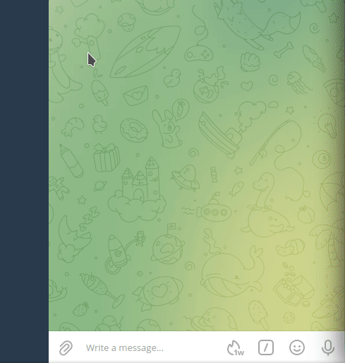
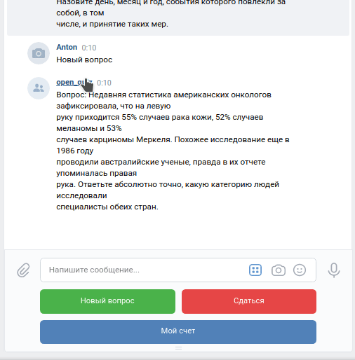

# Боты для Telegram и VK.com для проведения викторины (quiz bots).

### 1. Telegram бот

1.1. Делаем все под Python 3.9.  
1.2. Не забываем про зависимости: 
```shell
pip install -r requirements.txt 
```
1.3. Обязательно создаем файл `.env`, без него, как без воздуха: 
```text
# Токен вашего Telegram бота
TELEGRAM-TOKEN=

# Имя, порт, пароль базы данных Redis для хранения заданных вопросов
REDIS-BASE=
REDIS-PORT=
REDIS-PASSWORD=

# Токен вашего VK.com бота
VK-TOKEN=
```
1.4. Ещё нам нужены файлы с вопросами и ответами, с помощью которых мы будем проводить викторину. 
Все файлы складываем в папку `questions`, имя файла - любое, формат `txt`, кодировка **только** `KOI8-R`.  
Два файла для примера, остальной архив качаем [тут](https://dvmn.org/media/modules_dist/quiz-questions.zip).

1.5. Скрипт Telegram бота очень короткий и всего с одним аргументом. Запускаем с помощью:

```shell
python bot_tg.py
```

А если что то незаладилось, включаем `DEBUG`: 
```shell
python bot_tg.py --debug=True
```
Результат примерно следующий:   


1.6 Очень полезно иметь под рукой:  

- [Базы данных от Redislabs](https://redislabs.com/)

### 2. VK.com бот
2.1. Выполните пункты 1.1-1.4, если они ещё не выполнены.  
2.2. Для группы ВКонтакте разрешите Сообщения и использование Ботов  
2.3. Запуск бота ВКонтакте такой-же простой:
```shell
python bot_vk.py
```

Если необходимо, включите `DEBUG`: 
```shell
python bot_vk.py --debug=True
```

После запуска вы получите примерно следующий результат:   

